# investment-research

投資リサーチ用の市場データ取得・分析プロジェクト。フェーズごとの計画は [PLAN.md](PLAN.md) を参照。

## セットアップ

```
python -m venv .venv
.venv\Scripts\activate
pip install -r requirements.txt
```

## 実行方法

```
python src/data/fetch_prices.py       # config/assets.toml の全資産を取得 → data/raw/<ticker>.csv
python src/data/quality_check.py      # 全資産の品質チェック → reports/comparison/data_quality.csv
python src/data/build_dataset.py      # 共通期間のデータセット作成 → data/processed/prices.csv
python src/analysis/compare_assets.py # 資産比較 → reports/comparison/
python src/analysis/analyze_voo.py    # VOO 単体レポート(Phase 1) → reports/
python src/simulation/run_dca.py      # Phase 3 全期間の積立シミュレーション → reports/simulation/
python src/simulation/run_scenarios.py # Phase 3 開始時期・期間・暴落別の比較 → reports/simulation/
python src/portfolio/run_portfolios.py # Phase 4 ポートフォリオ比較 → reports/portfolio/
python src/backtest/run_backtest.py   # Phase 5 戦略のバックテスト → reports/backtest/
python src/statistics/run_statistics.py # Phase 6 統計的評価 → reports/statistics/
python -m pytest                      # テスト
```

VOO だけ取り直すときは `python src/data/fetch_voo.py`。

## ディレクトリ構成

```
config/
├─ assets.toml               比較する資産とローリング期間の設定
├─ simulation.toml           積立額・比較する投資期間・暴落の判定基準
├─ portfolios.toml           ポートフォリオの配分・リバランス頻度・金額・無リスク資産
├─ backtest.toml             バックテストの戦略・手数料・スリッページ・ベンチマーク
└─ statistics.toml           統計評価のローリング窓・VaR 信頼水準・ブートストラップ・市場局面の定義
src/
├─ data/
│  ├─ prices.py              取得仕様・設定読み込み・CSV 入出力(共通部品)
│  ├─ fetch_prices.py        設定にある全資産を取得
│  ├─ fetch_voo.py           VOO だけ取得
│  ├─ quality_check.py       全資産の品質チェック
│  └─ build_dataset.py       共通期間にそろえた比較用データセットを作成
├─ analysis/
│  ├─ metrics.py             リターン・リスク指標の定義(全分析で共通)
│  ├─ compare_assets.py      複数資産の比較分析
│  └─ analyze_voo.py         VOO 単体の分析
├─ simulation/
│  ├─ dca.py                 積立・一括投資のエンジン、ドローダウンと回復期間
│  ├─ scenarios.py           開始日・期間・暴落タイミングを変えて繰り返し実行
│  ├─ run_dca.py             全期間の実行
│  └─ run_scenarios.py       シナリオ比較の実行とグラフ出力
├─ portfolio/
│  ├─ portfolio.py           設定の検証、Buy & Hold・リバランス・積立のエンジン、指標
│  └─ run_portfolios.py      全ポートフォリオの比較とグラフ出力
├─ backtest/
│  ├─ strategies.py          戦略の共通インターフェースと戦略(売買ルール)
│  ├─ engine.py              日次バックテストエンジン(ポジション・現金・約定・コスト)
│  ├─ provenance.py          入力のハッシュ値と git の状態の記録(Phase 5・6 で共通)
│  └─ run_backtest.py        全戦略の実行、ベンチマーク比較、CSV・グラフ・再現情報の出力
└─ statistics/
   ├─ performance.py         基本指標・リスク調整指標・分布・VaR/CVaR・ローリング・ベンチマーク差・相関
   ├─ regimes.py             市場局面の定義と局面別の成績
   ├─ inference.py           信頼区間・Sharpe の標準誤差・ブートストラップ・多重検定の補正
   ├─ trades.py              売買単位(往復)の損益集計
   └─ run_statistics.py      全戦略の統計評価、CSV・グラフ・再現情報の出力
tests/                       自動テスト(pytest)
data/
├─ raw/<ticker>.csv          資産ごとの取得データ
└─ processed/prices.csv      共通期間の調整後終値(列 = 資産)
reports/
├─ comparison/               Phase 2 の比較結果(CSV とグラフ)
├─ simulation/               Phase 3 の積立シミュレーション結果(CSV とグラフ)
├─ portfolio/                Phase 4 のポートフォリオ比較結果(CSV とグラフ)
├─ backtest/                 Phase 5 のバックテスト結果(CSV・グラフ・run_info.json)
├─ statistics/               Phase 6 の統計評価(CSV・グラフ・run_info.json)
├─ figures/                  Phase 1 の VOO グラフ
├─ voo_yearly_returns.csv
└─ voo_monthly_returns.csv
```

## データ仕様

### 取得データ `data/raw/<ticker>.csv`

| 項目 | 内容 |
|---|---|
| 取得元 | Yahoo Finance(yfinance 1.7) |
| 期間 | 各資産の上場日 〜 取得時点で確定している最新営業日 |
| 頻度 | 日次(通常取引時間のみ、時間外取引は含まない) |
| 価格 | 株式分割・配当を反映した調整後価格(`auto_adjust=True`)。Close は配当再投資込みのトータルリターンベース |
| 列 | Close, High, Low, Open(上場通貨建て)、Volume(株数) |
| 形式 | ヘッダーが3行(`Price` / `Ticker` / `Date`)、以降1営業日1行 |

取得時に除外する行:

- Open / High / Low / Close のいずれかが欠損している行(Yahoo が出来高だけ返すことがあるため)
- ニューヨーク時間 16:00 の終値確定前に取得した場合の当日の行(取引途中の値のため)

注意点:

- 調整後価格は Yahoo 側で取得のたびに再計算されるため、再取得すると過去の値も小数点以下でわずかに変わる。git の差分が CSV 全体に出るのはこのため。
- 米国市場の祝日は行がない。

### 品質チェックの基準(`quality_check.py`)

以下をすべて満たせば合格。1つでも満たさない資産があればエラー終了する。

- 欠損値がない
- 日付の重複がない
- 0 以下の価格がない
- High < Low の行がない

参考値として、行のない平日の数(祝日)と、1日の最大変動率(調整後価格の異常の発見用)も出力する。

### 比較用データセット `data/processed/prices.csv`

- 列:`Date` と各資産のティッカー(値は調整後終値)。ヘッダーは1行。
- 期間:全資産の上場日のうち最も遅い日から、最終日のうち最も早い日まで。
- 全資産に価格がある日だけを残す。これにより、すべての指標が同じ日付の集合で計算される。

### 指標の定義(`metrics.py`)

| 指標 | 計算方法 |
|---|---|
| 累積リターン | 最終日終値 ÷ 初日終値 − 1 |
| 年率リターン(CAGR) | (1 + 累積リターン) ^ (1 / 年数) − 1。年数 = 日数 ÷ 365.25 |
| 年率ボラティリティ | 日次リターンの標準偏差 × √252 |
| 最大ドローダウン | 各日の終値 ÷ その日までの最高値 − 1 の最小値 |
| ローリングリターン | 直近 N 営業日のリターンを年率換算(N = 252 なら直近1年のリターンそのもの) |
| ローリングボラティリティ | 直近 N 営業日の日次リターンの標準偏差 × √252 |
| 相関 | 日次リターンと月次リターンのピアソン相関係数 |
| 年次・月次リターン | 各期末の終値 ÷ 前期末の終値 − 1。最初の期は初日の終値から |
| Sharpe ratio | 超過リターン(日次リターン − BIL の日次リターン)の平均 × 252 ÷ (その標準偏差 × √252) |

N は `config/assets.toml` の `rolling_window_days`(初期値 252)。

---

## Phase 6:ポートフォリオ数学・統計

Phase 5 の4戦略(コストあり、2011-09-08 〜 2026-09-21、日次リターン 3,779 件)を、同じ定義で統計的に評価する。入力はレポートの CSV ではなく、`config/backtest.toml` と価格データから Phase 5 のバックテストをそのまま実行し直した結果を使う(丸め誤差を持ち込まないため)。

### チェックリストとの対応

| 項目 | 実装 | 出力 |
|---|---|---|
| A 基本指標 | `performance.py`(累積リターン・CAGR・ボラティリティ・最大DD と日付・回復期間・最終資産) | `strategy_metrics.csv` |
| B リスク調整 | Sharpe・Sortino・Calmar、境界ケースは NaN | `risk_metrics.csv` |
| C リターン分布 | 平均・中央値・標準偏差・歪度・尖度・最小・最大・7つのパーセンタイル(日次・月次) | `return_distribution.csv`、`figures/return_distribution/` |
| D VaR / CVaR | ヒストリカル法、95%・99%、日次・月次 | `var_cvar.csv` |
| E ローリング | リターン・ボラティリティ・Sharpe・窓内の最大DD・ベンチマークとの差、窓 63 日と 252 日(基本) | `rolling_metrics.csv`、`figures/rolling/` |
| F 売買・損益構造(発展) | 往復の売買ごとの損益、勝率・Profit Factor・連勝/連敗。適用できない戦略は理由を記録 | `trade_statistics.csv`、`trades.csv` |
| G ベンチマーク比較 | Buy & Hold VOO との差を8指標で記録(優劣の判定はしない) | `benchmark_comparison.csv`、`figures/risk_return/benchmark_comparison.png` |
| H 相関・共分散 | 戦略・VOO・BIL の日次・月次・下落日の相関、日次・年率の共分散 | `correlation.csv`、`figures/correlation/` |
| I 市場局面 | 強気・弱気・高ボラ・低ボラ・大幅下落の5局面 | `regime_analysis.csv`、`regime_periods.csv`、`figures/regime/` |
| J 統計的検証 | 平均の信頼区間(通常・Newey-West)、Sharpe の標準誤差、Probabilistic Sharpe Ratio、ブートストラップ(1日単位・21日ブロック)、Holm 補正 | `statistical_tests.csv`、`figures/statistical/` |
| K 統計的問題 | このセクション後半の「バックテストの統計的な限界」 | README |
| L テスト | `tests/test_statistics.py`(34 件)。テスト全体は 116 件 | |
| M レポート | `reports/statistics/` | |
| N 再現性・CI | `run_info.json`(データ・設定2つのハッシュ、commit、`git_dirty`、バージョン、seed) | |

### 共通の約束事

| 項目 | 内容 |
|---|---|
| リターン | 単純リターン。小数で表す(0.01 = 1%) |
| 年率換算 | 平均は × 252、標準偏差は × √252。CAGR は暦日で年数を数える(日数 ÷ 365.25) |
| 無リスク金利 | 同じ日の BIL の日次リターン。超過リターン = 戦略の日次リターン − BIL の日次リターン |
| 列名 | すべて snake_case。年率換算した値は `_annualized` で終わる。付いていないリターン・リスクの値は、その行の頻度(daily / monthly)か全期間の値 |
| 日数 | `recovery_days`・`underwater_days`・`median_recovery_days` は暦日。`trading_days`・`observations` は営業日(件数) |
| 欠損値 | 資産額の欠損日は計算前に除き、前後の有効な日の間でリターンを計算する。CSV の空欄は「定義できない」(件数不足・ゼロ除算・未回復・適用外)を表す |
| 損失の符号 | VaR・CVaR は損失を正の数で表す(0.02 = 2% の損失)。最大DD と差の列は符号付き(−0.34 = 34% の下落) |

### 指標の定義

| 指標 | 定義 | 定義できない場合(NaN) |
|---|---|---|
| 累積リターン | 最終資産 ÷ 初日の資産 − 1 | データが1件以下 |
| CAGR | (最終資産 ÷ 初日の資産)^(1 ÷ 年数) − 1 | データが1件以下 |
| 年率ボラティリティ | 日次リターンの標本標準偏差 × √252 | リターンが1件以下 |
| 最大DD | 資産 ÷ それまでの最高値 − 1 の最小値。下落がなければ 0 | データなし |
| 回復期間 | 底の日から、直前の高値を再び上回る日までの暦日数。`underwater_days` は高値から回復まで | 回復していない |
| Sharpe | 超過リターンの平均 ÷ その標準偏差 × √252 | 標準偏差が 0(変動ゼロ) |
| 下方偏差 | √(全日の min(超過リターン, 0)² の平均) × √252。目標は無リスク金利、分母は全日数 | データなし |
| Sortino | 超過リターンの平均 × 252 ÷ 年率の下方偏差 | 下方偏差が 0(超過リターンが一度もマイナスにならない) |
| Calmar | CAGR ÷ \|最大DD\|(全期間) | 最大DD が 0 |
| 歪度・尖度 | pandas の標本歪度と超過尖度(正規分布で 0) | 歪度は3件未満、尖度は4件未満 |
| パーセンタイル | 線形補間(numpy の既定) | データなし |
| ヒストリカル VaR | −(1 − 信頼水準)分位点。例:95% VaR = −5% 分位点 | 件数が 1 ÷ (1 − 信頼水準) 未満(95% は 20 件、99% は 100 件) |
| ヒストリカル CVaR | −(VaR の分位点以下のリターンの平均) | 同上 |
| ローリング | 各日の値は、その日を含む直前 N 営業日だけで計算する。リターンは (E_t ÷ E_{t−N})^(252÷N) − 1 | 窓がそろう前の日は出力しない |
| 月次リターン | 月末の資産で計算する。最初の月と、月の最終営業日まで届いていない最後の月は除く | |

月次の VaR は、月次リターン(179 件)から同じ方法で計算している。

### 市場局面の定義(`regimes.py`、しきい値は `config/statistics.toml`)

VOO の価格で、各日の終値の時点で判定する(その日までの価格だけを使う)。

| 局面 | 判定 |
|---|---|
| bull(強気) | 終値 > 200 日移動平均 |
| bear(弱気) | 終値 ≤ 200 日移動平均 |
| high_volatility | 直近 63 日の年率ボラティリティ ≥ 20% |
| low_volatility | 同 ≤ 12% |
| large_drawdown(大幅下落) | それまでの最高値から 15% 以上下 |

- ある日の終値で決まった局面は、**翌日のリターン** に割り当てる(当日の終値を見てから当日のリターンを分類しないため)。
- 局面は重なりうる(例:弱気かつ高ボラ)。移動平均やボラティリティの計算に必要な日数がそろわない日は、その局面に含めない。
- 局面ごとに、日数・連続した期間の数・複利リターン・年率リターン・ボラティリティ・Sharpe・期間内の最大DD と、損失で終わった期間が元の水準に戻るまでの日数を出す。

### 統計的検証の方法(`inference.py`)

- **信頼区間:** すべて両側 95%。
- **平均リターン:** 通常の方法と、日々のリターンの自己相関を考慮した Newey-West 法(ラグ = ⌊4(n/100)^(2/9)⌋ = 8)。どちらも正規分布の分位点を使う(n = 3,779 なので t 分布とほぼ同じ)。
- **Sharpe の標準誤差:** Lo(2002)の i.i.d. 近似と、歪度・尖度を補正した Mertens(2002)の式。
- **Probabilistic Sharpe Ratio:** 本当の Sharpe が 0 より大きい確率(Bailey & López de Prado 2012)。
- **ブートストラップ:** 日を単位に、全戦略と BIL を同じ日の組で再標本化する(戦略どうしの差の比較が崩れないように)。1日単位(i.i.d.)と、連続する 21 日を1かたまりにする循環ブロック法の2通り。2,000 回、seed は `config/statistics.toml` で固定(20260923)。
- **信頼区間の出し方:** 再標本化した値の 2.5% 点と 97.5% 点(パーセンタイル法)。
- **p 値:** ベンチマークとの差について、2 × min(P(差 ≤ 0), P(差 ≥ 0))。各確率は (件数 + 1) ÷ (試行数 + 1) で見積もるため、0 にはならない。
- **多重検定:** 同じ手法・同じ統計量で3戦略を比べる組ごとに、Holm 法で補正する(`p_value_holm`)。

### 結果(2011-09-08 〜 2026-09-21、コストあり)

基本指標とリスク調整指標:

| | CAGR | ボラティリティ | 最大DD(底) | 回復日数 | Sharpe | Sortino | Calmar | 最終資産 |
|---|---|---|---|---|---|---|---|---|
| Buy & Hold VOO | 15.52% | 16.85% | −34.0%(2020-03-23) | 140 | 0.85 | 1.21 | 0.46 | 87,484 |
| 60/40 annual rebalance | 10.17% | 10.31% | −21.2%(2020-03-23) | 119 | 0.85 | 1.19 | 0.48 | 42,907 |
| VOO 200-day trend | 8.90% | 14.14% | −35.5%(2020-03-23) | 389 | 0.57 | 0.78 | 0.25 | 36,018 |
| Momentum top 1 | 6.91% | 15.74% | −37.9%(2020-03-23) | 525 | 0.41 | 0.56 | 0.18 | 27,302 |

日次リターンの分布と VaR / CVaR:

| | 歪度 | 超過尖度 | 95% VaR | 95% CVaR | 99% VaR | 99% CVaR | 正規分布を仮定した 99% VaR |
|---|---|---|---|---|---|---|---|
| Buy & Hold VOO | −0.34 | 14.3 | 1.60% | 2.53% | 3.03% | 4.28% | 2.41% |
| 60/40 annual rebalance | −0.49 | 16.2 | 0.98% | 1.53% | 1.79% | 2.62% | 1.47% |
| VOO 200-day trend | −0.81 | 24.0 | 1.35% | 2.20% | 2.57% | 3.93% | 2.03% |
| Momentum top 1 | −0.44 | 18.6 | 1.54% | 2.48% | 3.03% | 4.28% | 2.28% |

統計的検証(21 日ブロックのブートストラップ、95% 信頼区間):

| | Sharpe | Sharpe の信頼区間 | Buy & Hold との Sharpe の差 | 差の信頼区間 | p 値(Holm 補正後) | CAGR の差の p 値(Holm 補正後) |
|---|---|---|---|---|---|---|
| Buy & Hold VOO | 0.85 | 0.37 〜 1.37 | − | − | − | − |
| 60/40 annual rebalance | 0.85 | 0.35 〜 1.38 | −0.01 | −0.09 〜 0.08 | 0.873 | 0.004 |
| VOO 200-day trend | 0.57 | 0.10 〜 1.09 | −0.28 | −0.54 〜 −0.00 | 0.098 | 0.009 |
| Momentum top 1 | 0.41 | −0.04 〜 0.91 | −0.44 | −0.75 〜 −0.15 | 0.012 | 0.003 |

売買単位の損益(往復の売買のみ。Buy & Hold と 60/40 は適用外):

| | 往復の数 | 勝率 | 平均の勝ち | 平均の負け | Profit Factor | 最大連敗 |
|---|---|---|---|---|---|---|
| VOO 200-day trend | 23 | 47.8% | +18.3% | −3.6% | 3.57 | 3 |
| Momentum top 1 | 51 | 68.6% | +5.0% | −4.1% | 2.97 | 3 |

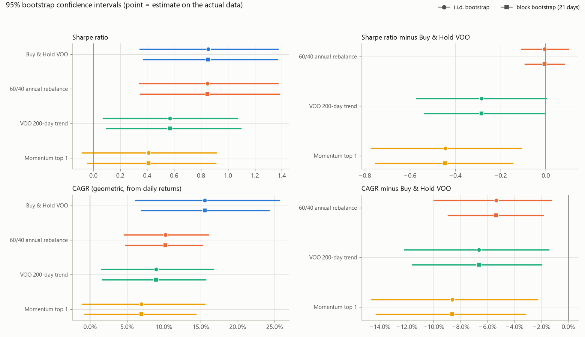
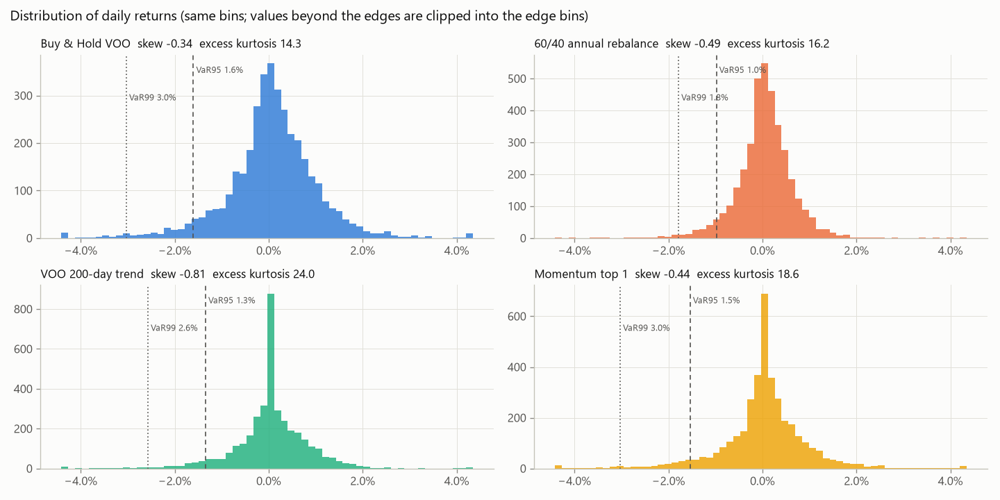
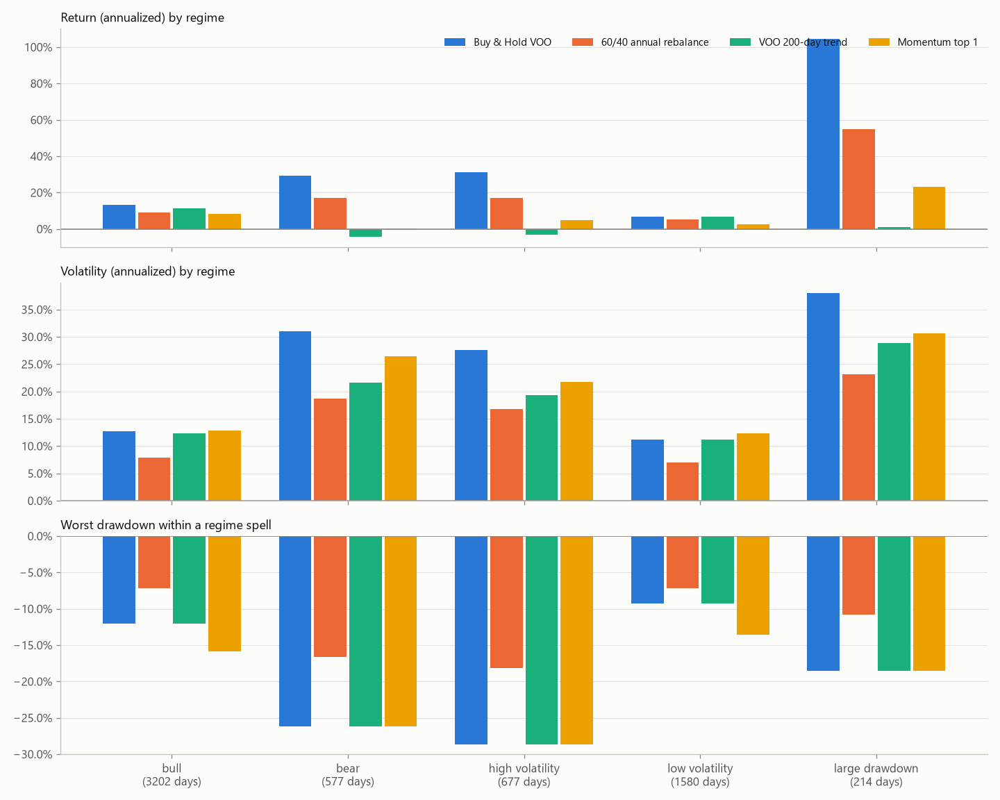

### 分かったこと

**Sharpe の推定には大きな幅がある**
- 15 年分の日次データでも、Sharpe の標準誤差は約 0.26 ある。Buy & Hold の Sharpe 0.85 の 95% 信頼区間は 0.37 〜 1.37 と広い。
- Buy & Hold と 60/40 の Sharpe の差(−0.01)は、統計的に区別できない(p = 0.87)。Phase 4・5 で「ほぼ同じ」と書いたのは、データからもそう言える。

**Buy & Hold より低いと言えるもの、言えないもの**
- CAGR は、3戦略とも Buy & Hold より低いことが統計的にも支持された(Holm 補正後の p ≤ 0.009)。
- Sharpe で Buy & Hold より低いと言えるのはモメンタムだけ(補正後の p = 0.012)。トレンドの差(−0.28)は、補正前は p = 0.049 だが、3戦略を同時に比べた補正をすると p = 0.098 で、5% の水準では区別できない。

**リターンの分布は正規分布より裾が厚い**
- 超過尖度は 14 〜 24(正規分布なら 0)。99% VaR は、標準偏差から正規分布を仮定して計算した値より 22 〜 33% 大きい。正規分布を前提にしたリスクの見積もりは、損失を小さく見積もる。
- 歪度は全戦略でマイナス(大きな下落のほうが大きな上昇より起きやすい)。トレンドは最もマイナス(−0.81)で、尖度も最も高い(24)。BIL を持つ日にはリターンがほぼ 0 に集まり、株を持っている日の暴落が裾に残るため。

**トレンド戦略は少数の大勝ちで稼ぐ形**
- 勝率は 48% だが、平均の勝ち +18.3% に対して平均の負けは −3.6% で、Profit Factor は 3.57。BIL との往復を除く(株の保有だけ)と 11 回で勝率 55%。

**局面別に見ると、トレンド戦略の弱点がはっきりする**
- VOO が 200 日平均を下回っていた日(弱気、577 日)の翌日に、Buy & Hold は年率 +29% だったのに対し、トレンドは −4.5%。高ボラ局面でも同様(+31% と −3.0%)。
- 弱気・高ボラの局面には、暴落のあとの急な反発が含まれる。トレンド戦略はこの反発を取り逃がし、下落だけを受けていた。
- 大幅下落局面の Buy & Hold の年率 +105% は、2020年3〜4月などの急反発によるもの。この局面は「最高値から −15% より上に戻ると終わる」定義のため、損失で終わる期間は構造的に生まれにくい(`losing_spells` = 0)。この値は「大幅に下げた後に持っていた場合」の結果として読む。

**相関**
- 日次リターンの VOO との相関は、60/40 0.98、トレンド 0.84、モメンタム 0.79。VOO が下げた日だけで見ると、トレンド 0.79、モメンタム 0.75 と少し下がる。どの戦略も BIL との相関はほぼ 0。

### バックテストの統計的な限界

- **Look-ahead bias(未来の情報)**
  - 対策済み:戦略は判断日までの価格しか見ず、翌営業日に約定する(Phase 5)。ローリング指標と市場局面も、その日までのデータだけで計算する。いずれもテストで確認している。
  - 残る点:調整後価格は、あとから支払われた配当で過去の価格を調整したもの。価格の水準そのものは実際の取引価格と違うが、リターンは実際の配当込みリターンと一致する。
- **Survivorship bias(生き残りバイアス)**
  - 対象は、今も存在し規模の大きい ETF だけ。途中で消えた ETF や、成績が悪く選ばれなかった資産は、最初から入っていない。
- **Selection bias(選択バイアス)**
  - 期間(2010年以降)は VOO の上場日で決まり、たまたま米国株が特に強い期間になった。
  - 米国株を中心に選んだこと自体が、その後の成績を知っている現在の視点による選択。
- **Data snooping(データののぞき見)**
  - Phase 2〜5 で同じ期間のデータを何度も見ている。今後この結果を見てから作る戦略は、同じ期間では公平に評価できない。新しい戦略は、まだ見ていない期間(今後のデータ)で確かめる必要がある。
- **Multiple testing(多重検定)**
  - 比べる戦略・指標・手法が増えるほど、偶然「有意」になる組が増える。ここでは同じ手法・同じ統計量の3戦略の比較に Holm 補正をかけた。
  - パラメータを多く試した場合は、試した回数を考慮した評価(Deflated Sharpe Ratio など)が必要になる。
- **Overfitting(過学習)**
  - 戦略のパラメータ(200 日、252 日、月1回)は一般的な値のまま、この期間に合わせた調整はしていない。
  - ただし、戦略の選び方自体が一般的な知識に影響されており、完全に独立な検証ではない。
- **系列相関**
  - 日次リターンには、ボラティリティの集中(荒れた日が続く)がある。1日単位のブートストラップはこれを無視するため、21 日ブロック法と Newey-West 法も併記した。
- **実質的なサンプル数**
  - 日次リターンは 3,779 件あるが、大きな下落局面は 2020年・2022年など数回しかない。暴落時のふるまいについての結論は、数回の出来事に強く依存する。

### Phase 7(機械学習)で注意すること

- **データの分け方:** 時系列を無作為に分けず、過去で学習して未来で検証する(walk-forward)。
- **ラベルの重なり:** 予測対象(例:翌 21 日のリターン)が重なる場合は、学習データと検証データの間を空ける(purging / embargo)。
- **前処理:** 標準化・特徴量の選択・欠損値の補完は、学習データの範囲だけで決める。全期間の平均や分散を使うと、未来の情報が混ざる。
- **特徴量:** その時点で入手できるデータだけで作る(このフェーズの局面判定と同じ)。
- **ベースライン:** Buy & Hold と、このフェーズの単純なルールを必ず比べる相手にする。
- **評価の仕方:** コスト込みで評価し、予測の当たりやすさと、投資戦略としての損益・リスクは分けて評価する。
- **多重比較:** 多くのモデルやパラメータを試したら、その回数を考慮した評価(多重検定の補正、Deflated Sharpe)を使う。
- **環境の変化:** 株と債券の相関のように、市場の関係は時期によって変わる(Phase 2 で確認)。過去の関係が続く前提を置かない。

### 出力 `reports/statistics/`

| ファイル | 1行の単位 | 主な列 |
|---|---|---|
| `strategy_metrics.csv` | 戦略 | `total_return`, `cagr`, `volatility_annualized`, `max_drawdown`, `max_drawdown_peak_date`, `max_drawdown_trough_date`, `recovery_date`, `recovery_days`, `underwater_days`, `final_equity` |
| `risk_metrics.csv` | 戦略 | `sharpe_ratio`, `sortino_ratio`, `calmar_ratio`, `mean_excess_return_annualized`, `downside_deviation_annualized`, `risk_free_cagr` |
| `return_distribution.csv` | 戦略 × 頻度 | `observations`, `mean`, `median`, `std`, `skewness`, `excess_kurtosis`, `min`, `max`, `p01` 〜 `p99`(その頻度のリターン、年率換算なし) |
| `var_cvar.csv` | 戦略 × 頻度 × 信頼水準 | `observations`, `tail_observations`, `var`, `cvar`(損失を正の数で) |
| `rolling_metrics.csv` | 日付 × 戦略 × 窓 | `rolling_return_annualized`, `rolling_volatility_annualized`, `rolling_sharpe`, `rolling_max_drawdown`, `rolling_excess_return_vs_benchmark` |
| `benchmark_comparison.csv` | 戦略 × 指標 | `strategy_value`, `benchmark_value`, `difference`(戦略 − ベンチマーク) |
| `correlation.csv` | 行列 × 系列 | `matrix`(日次・月次・下落日の相関、日次・年率の共分散)と各系列の列 |
| `regime_analysis.csv` / `regime_periods.csv` | 戦略 × 局面 / 局面の連続期間 | `trading_days`, `spells`, `cumulative_return`, `return_annualized`, `volatility_annualized`, `sharpe_ratio`, `max_drawdown_within_spell`, `losing_spells`, `recovered_spells`, `median_recovery_days` |
| `statistical_tests.csv` | 戦略 × 統計量 × 手法 | `estimate`, `standard_error`, `ci_lower`, `ci_upper`, `confidence`, `p_value`, `p_value_holm`, `observations`, `resamples`, `block_size`, `seed`, `lag` |
| `trade_statistics.csv` / `trades.csv` | 戦略 × 範囲 / 往復の売買 | `applicable`, `reason`, `win_rate`, `profit_factor`, `max_consecutive_wins`, `max_consecutive_losses` / `entry_date`, `exit_date`, `profit`, `return` |
| `run_info.json` | − | 入力ハッシュ(価格・`backtest.toml`・`statistics.toml`)、commit、`git_dirty`、期間、件数、ブートストラップの設定、バージョン |

グラフ `figures/`:`return_distribution/`(ヒストグラム、パーセンタイル)、`rolling/`(63 日・252 日)、`drawdown/`、`risk_return/`(リスクとリターン、ベンチマークとの差)、`correlation/`、`regime/`(局面の時系列、局面別の成績)、`statistical/`(ブートストラップの信頼区間)。

---

## Phase 5:バックテスト基盤（完了）

### 完了条件との対応

| 項目 | 実装 |
|---|---|
| Strategy | `strategies.Strategy`:`tickers` と `decide(history, first_day)` を持つ共通インターフェース |
| Signal | `decide` が目標配分(ティッカー → 資産に占める割合)を返す。変更しないときは `None` |
| Position | `BacktestResult.positions`:毎日の保有数量 |
| Cash | `BacktestResult.cash`:毎日の現金残高。買いは現金の範囲内に抑え、マイナスにしない |
| Transaction | `transactions.csv`:全売買(約定日・判断日・数量・終値・約定価格・金額・手数料・スリッページ・約定後の現金) |
| Costs | `CostModel`:売買金額に対する率と、1回あたりの最低額 |
| Slippage | `CostModel.slippage_rate`:買いは終値より高く、売りは安く約定 |
| Equity | `BacktestResult.equity`:毎日の終値で評価した資産(現金 + 保有数量 × 終値) |
| Benchmark | `benchmark` で指定した戦略(初期値 Buy & Hold VOO)と、同じ期間・同じコストで比較 |
| Look-ahead | 戦略には判断日までの価格しか渡さない。売買は翌営業日。テストで3通りに確認 |
| Reproducibility | 戦略は状態を持たず、乱数も使わない。入力のハッシュ値・commit・未コミット変更の有無・バージョンを `run_info.json` に記録 |
| Tests | `tests/test_backtest.py`(26 件)。テスト全体は 82 件で、GitHub Actions で push のたびに実行 |
| Reports | `reports/backtest/` の CSV 6本・グラフ5枚・`run_info.json` |

### 1日の流れ(エンジンの仮定)

1. 前の営業日の終値で決まった注文を、**今日の終値** で約定する(売りを先、買いを後)
2. 今日の終値で資産を評価して記録する
3. 戦略に **今日までの価格だけ** を渡し、新しい目標配分を受け取る → 翌営業日に約定

その他の仮定:

- 目標配分は「その時点の資産 × 配分 ÷ 終値」の数量に直して売買する。小数単位で売買できる。
- 配分の合計が 1 未満なら、残りは現金(利息ゼロ)で持つ。合計が 1 を超える、負の値、存在しないティッカーはエラーにする。
- 価格は配当込みの調整後終値なので、配当は自動で再投資されたことになる。
- 税金・為替は含まない。すべて USD 建て。

### 未来の情報を使わないための対策

- **戦略に渡すデータ:** 判断日までの価格だけを渡す。判断日の価格では売買せず、翌営業日の終値で約定する。
- **判断日:** 「月の最初の取引日」を使う。「月末」かどうかは翌日の日付を知らないと判定できないため使わない。
- **テストで確かめていること:**
  - 戦略が受け取ったデータの最終日が、毎日その日と一致する
  - データを途中で切っても、それまでの資産の推移が変わらない
  - 未来の価格を3倍に書き換えても、それより前の結果が変わらない

### 設定 `config/backtest.toml`

| 項目 | 初期値 | 意味 |
|---|---|---|
| `initial_cash` | 10000 | 開始時の現金 |
| `benchmark` | Buy & Hold VOO | 比較の基準にする戦略 |
| `warmup_days` | 252 | 取引を始めるまでの準備期間(営業日)。移動平均などの計算に使う過去データをそろえ、全戦略を同じ日に始める |
| `commission_rate` | 0.0005 | 手数料率(売買金額の 0.05%) |
| `commission_min` | 0 | 1回あたりの最低手数料 |
| `slippage_rate` | 0.0005 | スリッページ(終値から 0.05% 不利な価格で約定) |
| `risk_free_ticker` | BIL | Sharpe ratio の無リスク金利 |

戦略(`[[strategies]]`、`type` と各パラメータで指定):

| 名前 | type | 売買ルール |
|---|---|---|
| Buy & Hold VOO | `buy_and_hold` | 初日に VOO を買い、そのまま持つ(ベンチマーク) |
| 60/40 annual rebalance | `periodic_rebalance` | VOO 60% / BND 40%、年1回リバランス |
| VOO 200-day trend | `moving_average` | 毎月初め、VOO の終値が 200 日平均より上なら VOO、下なら BIL |
| Momentum top 1 | `momentum` | 毎月初め、VOO・VT・EWJ・BND のうち過去 252 日のリターンが最も高いものを持つ。BIL のリターンを下回るなら BIL |

新しい戦略は、`Strategy` を継承して `tickers` と `decide` を書き、`STRATEGY_TYPES` に登録すれば設定ファイルから使える。

### 出力 `reports/backtest/`

| ファイル | 内容 |
|---|---|
| `backtest_summary.csv` | 戦略 × {コストあり, なし} の指標、売買回数、回転率、手数料・スリッページの合計、コストによる CAGR の低下、ベンチマークとの差 |
| `equity_curves.csv` | コストありの毎日の資産 |
| `transactions.csv` / `signals.csv` | 全売買と、全ての判断(目標配分) |
| `yearly_returns.csv` | 年別リターン(期間別の検証) |
| `regime_returns.csv` | ベンチマークの暴落(15% 以上)の下落期・回復期と、ベンチマークが上がった月・下がった月の平均(市場環境別の検証) |
| `run_info.json` | 入力データと設定のハッシュ値、git の commit と未コミット変更の有無(`git_dirty`)、期間、Python とライブラリのバージョン、使った設定 |

### 結果の再現と確認

`run_info.json` を使うと、レポートがどのコード・データから作られたかを確認できる。

- `git_dirty` が `false` なら、`git_commit` の状態のコードで作られた(`reports/` 以外に未コミットの変更がなかった)。
- `prices_sha256` と `config_sha256` は、改行コードを LF にそろえてから計算した SHA-256。git に保存された内容と同じ値になるため、OS に関係なく次のように確かめられる。

```
git show <git_commit>:data/processed/prices.csv | sha256sum
```

- 同じ commit で `python src/backtest/run_backtest.py` を実行すると、同じ CSV が作られる(2026-09-23 に再生成して、数値の CSV 6本が1バイトも変わらないことを確認済み)。
| `figures/` | 資産の推移、ドローダウン、保有配分、年別リターン、コストの影響 |

### 結果(2011-09-08 〜 2026-09-21、コストあり)

| | CAGR | ボラティリティ | 最大DD | Sharpe | 売買回数 | 年間回転率 | コストによる CAGR 低下 | ベンチマークとの差 |
|---|---|---|---|---|---|---|---|---|
| Buy & Hold VOO | 15.52% | 16.85% | −34.0% | 0.85 | 1 | 1% | 0.01 pt | − |
| 60/40 annual rebalance | 10.17% | 10.31% | −21.2% | 0.85 | 32 | 5% | 0.01 pt | −5.35 pt |
| VOO 200-day trend | 8.90% | 14.14% | −35.5% | 0.57 | 47 | 161% | 0.34 pt | −6.62 pt |
| Momentum top 1 | 6.91% | 15.74% | −37.9% | 0.41 | 103 | 321% | 0.73 pt | −8.61 pt |

市場環境別のリターン(`regime_returns.csv` から抜粋):

| | Buy & Hold VOO | 60/40 | 200-day trend | Momentum |
|---|---|---|---|---|
| 2020年の暴落(2/19 → 3/23) | −34.0% | −21.2% | −34.0% | −34.0% |
| 2020年の回復(3/23 → 8/10) | +51.7% | +30.0% | +23.4% | +20.9% |
| 2022年の下落(1/3 → 10/12) | −24.5% | −20.5% | −16.5% | −12.1% |
| 2022年からの回復(10/12 → 2023/12/13) | +34.2% | +22.9% | +8.4% | +13.0% |
| ベンチマークが上がった月の平均 | +3.33% | +2.17% | +2.35% | +1.99% |
| ベンチマークが下がった月の平均 | −3.42% | −2.22% | −2.92% | −2.56% |

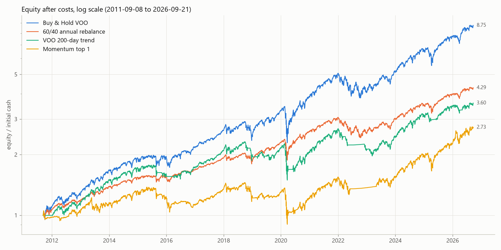
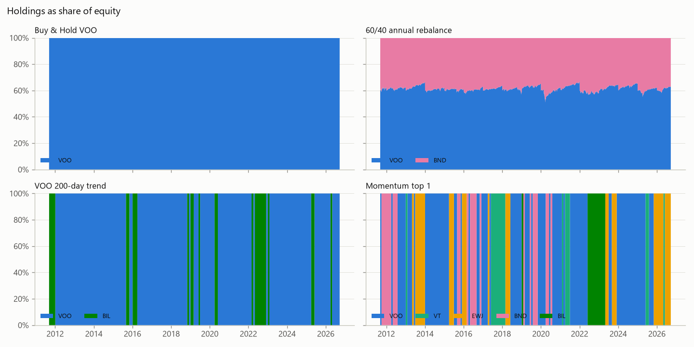
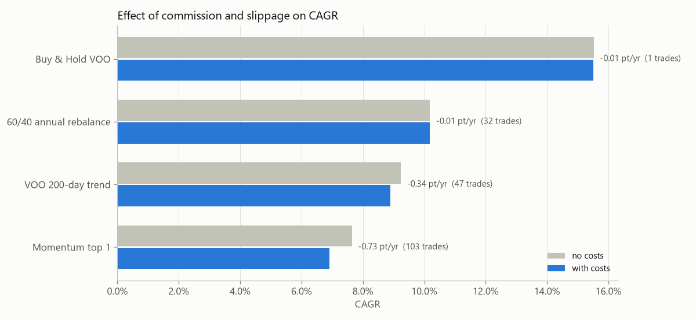

### 分かったこと

**この期間では、どのルールも Buy & Hold に勝てなかった**
- 年別でも、Buy & Hold を上回った年は 60/40 で 16 年中 2 年、トレンドで 1 年、モメンタムで 2 年だけだった。
- リスクあたりのリターン(Sharpe)で Buy & Hold と並んだのは 60/40 だけ(0.85)。

**トレンドとモメンタムは、ゆっくりした下落には効いたが、急な暴落には間に合わなかった**
- 2022年のゆっくりした下落では、Buy & Hold の −24.5% に対してトレンド −16.5%、モメンタム −12.1% と損失を減らした。
- 1か月で起きた 2020年の暴落では、月1回の判断が間に合わず Buy & Hold と同じ −34% を受けた。そのうえ底の近くで売り、回復の大部分(+51.7% のうち半分以上)を取り逃がした。
- 上がった月は上昇の 71% しか取れないのに、下がった月は下落の 85% を受けた(トレンド)。損失を減らす以上に、上昇を取り逃がしている。
- トレンド戦略の最大DD(−35.5%)は、Buy & Hold より大きい。2019年に「安値で売って高値で買い戻す」往復を2回繰り返し(1月に 199.84 で売って3月に 228.63 で買い戻し、6月に 230.66 で売って7月に 244.96 で買い戻し)、保有数量が 97.6 株から 80.1 株に減った。その損が残ったまま 2020年の暴落を迎えたため、2018年9月の高値から測った下落が Buy & Hold より大きくなった。

**コストは売買の多い戦略ほど効く**
- 手数料 0.05% + スリッページ 0.05% という低めの設定でも、モメンタムは年 0.73 ポイント、トレンドは年 0.34 ポイントのリターンを失った。Buy & Hold と 60/40 は年 0.01 ポイント。
- 実際の口座では、これに売却のたびの税金が加わる(NISA 口座内を除く)。

### 解釈するときの注意

- 結果は 2011〜2026年という、米国株がほぼ一貫して上がった1つの期間のもの。長い下落相場(例:2000〜2002年、2008年)を含む期間では、トレンドやモメンタムの評価は変わりうる。今のデータは 2010年以降なので、その検証はできない。
- 戦略のパラメータ(200 日、252 日、月1回など)は一般的な値をそのまま使っており、この期間に合わせて調整していない。パラメータをこの期間に合わせて選ぶと、過去にだけ当てはまる結果(過学習)になりやすい。
- 約定は翌営業日の終値。実際の売買の価格(寄り付きなど)とは異なる。

---

## Phase 4:ポートフォリオ分析（完了）

### 完了条件との対応

| 完了条件 | 実装 |
|---|---|
| 複数資産の配分を設定ファイルから指定できる | `config/portfolios.toml` の `[[portfolios]]` |
| ウェイトの妥当性を自動検証できる | `validate_config`。問題をすべてまとめて報告し、実行を止める |
| ポートフォリオの日次リターン | `daily_returns`(入金分を除いた時間加重リターン) → `portfolio_daily_returns.csv` |
| 累積リターン・CAGR・年率ボラティリティ・最大ドローダウン | `summarize`。Phase 2 と同じ `metrics.py` の関数で計算 |
| Sharpe ratio | `metrics.sharpe_ratio`。無リスク金利は BIL の日次リターン |
| 相関を考慮した分散効果 | `diversification` → `portfolio_diversification.csv`、`figures/diversification.png` |
| Buy & Hold | `rebalance = "none"` |
| 定期リバランス | `annual` / `quarterly` / `monthly` |
| DCA との組み合わせ | `monthly_contribution` を指定すると、毎月の入金を目標配分で買い付ける |
| リバランス頻度を変更できる | `rebalance_frequencies`(比較する頻度)と `default_rebalance`(ポートフォリオ同士の比較に使う頻度) |
| 複数ポートフォリオを同一条件で比較 | 全ポートフォリオ × 全頻度 × {一括, 積立} を、同じ期間・同じ金額で実行(48 通り) |
| CSV 保存・グラフ出力 | `reports/portfolio/` |
| 自動テスト | `tests/test_portfolio.py`(32 件)。テスト全体は 56 件 |

### 設定 `config/portfolios.toml`

| 項目 | 初期値 | 意味 |
|---|---|---|
| `initial_investment` | 10000 | 一括投資の額(初日に投資) |
| `monthly_contribution` | 10000 | 積立の額(毎月の最初の取引日に投資) |
| `rebalance_frequencies` | none, annual, quarterly, monthly | 比較するリバランス頻度 |
| `default_rebalance` | annual | ポートフォリオ同士を比べるときの頻度 |
| `risk_free_ticker` | BIL | Sharpe ratio の無リスク金利に使う資産 |

ウェイトの検証ルール(1つでも破ると実行しない):

- ティッカーが `data/processed/prices.csv` にある
- 各ウェイトが 0 より大きく 1 以下の数値(空売り・レバレッジはなし)
- ポートフォリオごとの合計が 1(誤差 0.000001 まで)
- ポートフォリオ名が重複していない
- リバランス頻度・無リスク資産・金額の設定が正しい

初期値のポートフォリオ:

| 名前 | 配分 |
|---|---|
| US equity | VOO 100% |
| Global equity | VT 100% |
| US + Japan | VOO 70% / EWJ 30% |
| US 60/40 | VOO 60% / BND 40% |
| Global 60/40 | VT 60% / BND 40% |
| Conservative | VOO 30% / BND 40% / BIL 30% |

### 前提条件

- **売買のタイミング:** 入金日とリバランス日の終値で売買する。価格は配当込みの調整後終値なので、配当は自動で再投資されたことになる。
- **初日:** 目標配分どおりに買う。
- **リバランス:** 各期間(年・四半期・月)の最初の取引日に、資産全体を目標配分に戻す。
- **積立:** 毎月の入金を目標配分どおりに分けて買う。リバランスの頻度とは別に動く。
- **日次リターン:** その日の入金を差し引いてから計算する(時間加重)。入金による評価額の増加は、リターンに数えない。CAGR・ボラティリティ・最大DD・Sharpe はこのリターンから計算する。
- **積立の損益:** 最終評価額 ÷ 投資額と、Phase 3 と同じ「前回の高値 + その後の入金額」を基準にしたドローダウン(`money_max_drawdown`)も出す。
- **売買の量:** `annual_turnover` = 売買した金額の合計 ÷ 2 ÷ 平均評価額 ÷ 年数(片道の年間売買回転率)。
- **分散効果:** 日次リターンの共分散から、配分を一定に保った場合のボラティリティを計算する。これを「全資産の相関が1だった場合(各資産のボラティリティの加重平均)」と比べる。
- **含まないもの:** 手数料・税金・スプレッド・為替。すべて USD 建て。

### 出力 `reports/portfolio/`

| ファイル | 内容 |
|---|---|
| `portfolio_summary.csv` | ポートフォリオ × リバランス頻度 × {一括, 積立} の指標(48 行)。最終時点の配分も含む |
| `portfolio_diversification.csv` | 分散効果(加重平均ボラティリティ、ポートフォリオのボラティリティ、分散比率) |
| `portfolio_nav.csv` / `portfolio_daily_returns.csv` | 基準頻度(annual)の一括投資の日々の価値(初期値 1)と日次リターン |
| `portfolio_dca_values.csv` | 基準頻度の積立の評価額と投資額の推移 |
| `figures/growth.png` / `drawdowns.png` | 価値の推移(対数軸)とドローダウン |
| `figures/risk_return.png` | ボラティリティと CAGR(単一資産をグレーで併記) |
| `figures/rebalancing.png` | リバランス頻度別の CAGR・ボラティリティ・最大DD・Sharpe |
| `figures/weight_drift.png` | リバランスしない場合の配分のずれ |
| `figures/diversification.png` | 分散によってボラティリティがどれだけ下がったか |
| `figures/dca_growth.png` | 月 10,000 の積立の推移 |

### 結果(2010-09-09 〜 2026-09-21、年1回リバランス、一括投資)

| | CAGR | 年率ボラティリティ | 最大DD | Sharpe | 分散による ボラティリティ低下 |
|---|---|---|---|---|---|
| US equity | 14.95% | 16.97% | −34.0% | 0.83 | − |
| Global equity | 11.08% | 17.06% | −34.2% | 0.62 | − |
| US + Japan | 12.92% | 16.23% | −31.2% | 0.75 | −6% |
| US 60/40 | 9.96% | 10.27% | −21.1% | 0.84 | −14% |
| Global 60/40 | 7.64% | 10.29% | −22.3% | 0.63 | −14% |
| Conservative | 5.91% | 5.38% | −13.4% | 0.84 | −22% |

リバランス頻度の比較(US 60/40):

| | CAGR | ボラティリティ | 最大DD | Sharpe | 年間売買回転率 | 最終時点の配分 |
|---|---|---|---|---|---|---|
| なし(Buy & Hold) | 12.01% | 13.15% | −27.6% | 0.82 | 0% | VOO 91% / BND 9% |
| 年1回 | 9.96% | 10.27% | −21.1% | 0.84 | 3.3% | VOO 63% / BND 37% |
| 四半期 | 10.03% | 10.30% | −21.1% | 0.85 | 6.2% | VOO 61% / BND 39% |
| 毎月 | 9.94% | 10.32% | −21.7% | 0.84 | 9.6% | VOO 61% / BND 39% |

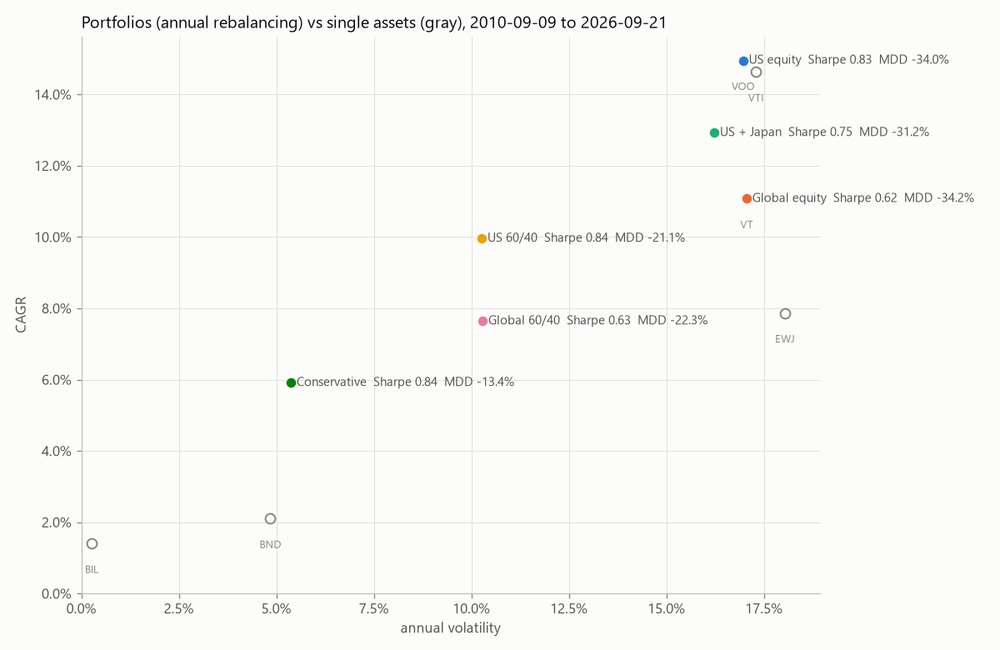
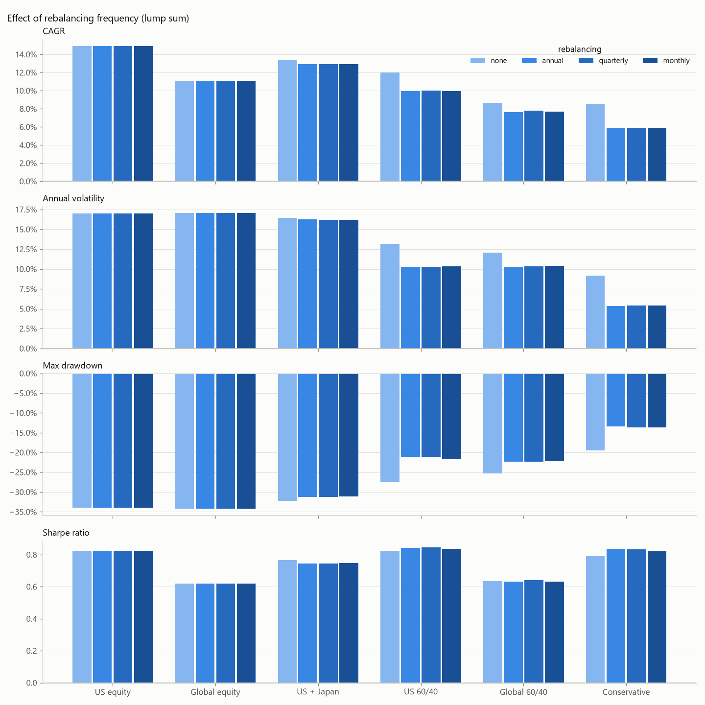
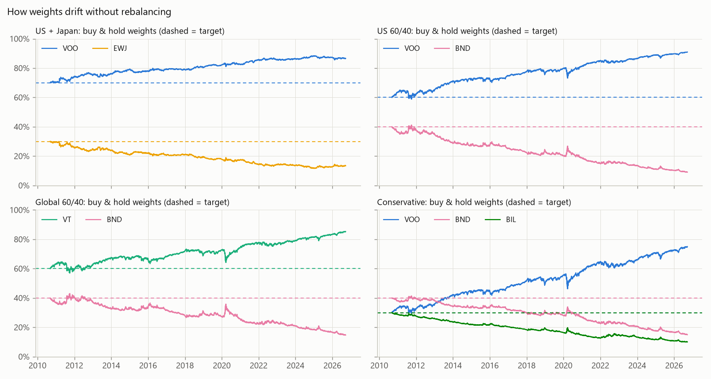
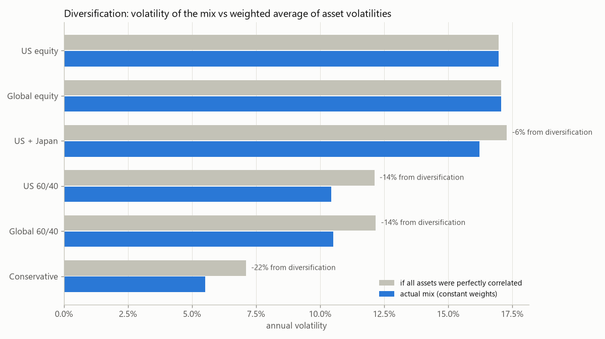

### 分かったこと

**分散効果は「相関の低い資産」を混ぜたときに大きい**
- 株と債券(日次リターンの相関 0.05)を 60/40 で混ぜると、ボラティリティは加重平均より 14% 下がった。短期国債(相関ほぼ 0)も加えた Conservative では 22% 下がった。
- 米国株と日本株(日次リターンの相関 0.72)の組み合わせでは 6% にとどまった。株式同士では、分散の効果は小さい。

**リスクあたりのリターン(Sharpe)は、米国株 100% と 60/40 でほぼ同じ**
- US equity 0.83、US 60/40 0.84、Conservative 0.84。債券を混ぜるとリターンは下がるが、リスクも同じくらい下がった。
- この期間の Global 系(0.62〜0.63)は、米国系より Sharpe が低かった。

**リバランスしないと、配分は大きくずれる**
- US 60/40 を買ったまま放置すると、16年で VOO 91% / BND 9% になり、実質ほぼ株式のポートフォリオになった。その結果、リターンは高かった(12.0%)が、最大DD も −27.6% と、60/40 として想定していたリスクを超えた。
- 年1回リバランスすると、配分はほぼ 60/40 に保たれ、最大DD は −21.1%。
- リバランスで得をしたわけではない(この期間は株が強かったため、放置したほうがリターンは高い)。リバランスの役割は、**リスクを決めた水準に保つこと** だと分かる。

**リバランスの頻度はほとんど結果を変えない**
- 年1回・四半期・毎月の差は、どのポートフォリオでも CAGR で 0.2 ポイント以内、最大DD で 0.6 ポイント以内。
- 一方で売買の量は、年1回 3.3% → 毎月 9.6% と約3倍になる。手数料や税を考えると、頻度を上げる理由は見当たらない。

**積立でも同じ傾向**
- 月 10,000 を 16 年(総額 1,930,000)積み立てた場合、最終評価額は US equity 7.23M、US 60/40 4.51M、Conservative 3.20M。
- 積立の最大ドローダウン(入金を考慮)は US equity −34.0%、US 60/40 −21.1%、Conservative −13.1%。

### 解釈するときの注意

- 結果は 2010〜2026年という1つの期間のもの。この期間は米国株が特に強く、2022年までは株と債券の相関も低かった(Phase 2 参照)。期間が変われば順位も変わりうる。
- 分散効果の計算は、全期間の相関を使っている。Phase 2 で見たとおり、株と債券の相関は 2022年以降に上がっており、最近ほど債券による分散効果は小さくなっている。
- 手数料・税を含まない。実際にはリバランスのたびに売却益への課税が発生しうる(NISA 口座内を除く)。
- USD 建てで、為替の影響を含まない。

---

## Phase 3:積立投資シミュレーション（完了）

Phase 2で整備した共通価格データを使い、毎月10,000の固定額を各月最初の取引日に投資するDCAを実装した。

- 小数単位の購入を許可
- 同じ総投資額を初日に一括投資するベースラインも計算
- 累積拠出額、評価額、損益を記録
- 資産ごとの結果をCSVに出力
- USD建て価格を使うため、10,000は正規化した拠出額として扱う

為替、手数料、税、実際の約定条件はPhase 9で扱う。

### 実装の対応表

| 項目 | 実装 |
|---|---|
| ① DCA基本エンジン 〜 ⑧ 複数資産 | `dca.py`、`run_dca.py` |
| ⑨ 開始時期を変える | `start_year_runs`:各年の最初の取引日から、最新の確定月まで積み立てる |
| ⑩ 投資期間を変える | `rolling_windows`:1/3/5/10年(`simulation.toml` の `horizons_years`) |
| ⑪ 暴落との関係 | `drawdown_episodes` で 15% 以上の下落を検出し、`crash_start_runs` で高値・底・回復日から開始 |
| ⑫ 最大ドローダウン | `contribution_adjusted_drawdown`:基準 = 前回の高値 + その後の入金額 |
| ⑬ 回復期間 | `drawdown_stats`:底から基準値に戻るまでの日数(暦日) |
| ⑭ 多数の開始日で比較 | 全ての月初を開始日にして実行し、`window_stats` で分布を集計 |
| ⑮ グラフ化 | `run_scenarios.py` → `figures/` |
| ⑯ テスト | `tests/`(pytest、24件) |

### シナリオの決め方

- **期間:** 開始日から、N か月目の月末の最終取引日までの「月まるごと」で区切る。データの最後の月は途中の可能性があるため、評価には使わない。
- **積立額と一括額:** 積立は開始日とその後の各月の最初の取引日に入金する。一括投資は同じ総額を開始日に投資する。
- **待機資金:** 積立でまだ投資していないお金は、**利息ゼロ** として扱う(BIL などで運用はしていない)。
- **積立のドローダウン:** 評価額の単純な高値を基準にすると、新しい入金で含み損が隠れる。そこで「前回の高値 + その後の入金額」を基準にした。一括投資では、これは通常のドローダウンと同じになる。
- **暴落期間:** 価格が高値から 15% 以上下げた期間を、高値 → 底 → 高値回復 の3点で記録する(`simulation.toml` の `crash_threshold`)。

### 出力 `reports/simulation/`

| ファイル | 内容 |
|---|---|
| `dca_summary.csv` / `dca_paths.csv` | 全期間の結果(ドローダウン・回復日数を含む)と日々の推移 |
| `dca_windows.csv` | 開始月×投資期間の全シナリオ(3,264 件) |
| `dca_window_stats.csv` | 資産×投資期間ごとの分布(一括投資の勝率、損失になった割合、ドローダウンなど) |
| `dca_by_start_year.csv` | 開始年別(最新の確定月まで積立) |
| `drawdown_episodes.csv` | 検出した暴落期間(22 件) |
| `dca_crash_starts.csv` | 暴落の高値・底・回復日から始めた結果 |
| `figures/start_date_{1,3,5,10}y.png` | 開始日別のリターン(暴落期間を網掛け) |
| `figures/lump_sum_win_rate.png` | 一括投資が積立を上回った割合 |

### 結果(2010-09 〜 2026-08 の開始日、USD 建て、配当込み)

一括投資が積立を上回った開始日の割合:

| | 1年 | 3年 | 5年 | 10年 |
|---|---|---|---|---|
| VOO | 83% | 98% | 100% | 100% |
| VTI | 82% | 96% | 100% | 100% |
| VT | 75% | 92% | 100% | 100% |
| EWJ | 65% | 80% | 97% | 100% |
| BND | 70% | 80% | 81% | 100% |
| BIL | 59% | 68% | 74% | 100% |

VOO で、積立の最終評価額が一括投資をどれだけ下回ったか(中央値):1年 −6.3%、3年 −16.6%、5年 −25.9%、10年 −42.9%。

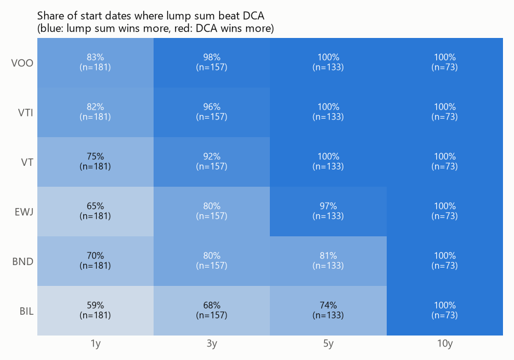
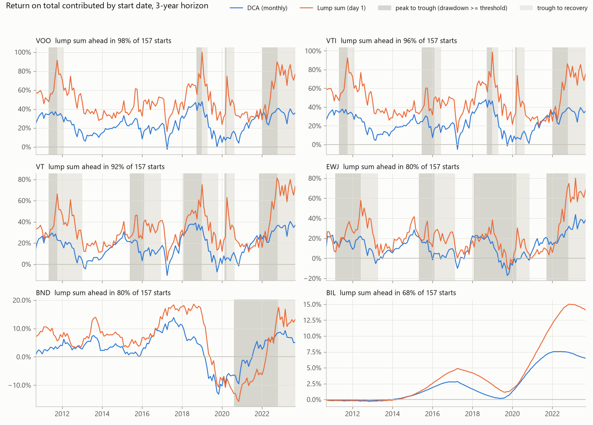

### 分かったこと

**この期間では、ほとんどの開始日で一括投資が上回った**
- 期間が長いほど差が広がる。5年以上の株式では、ほぼ全ての開始日で一括投資が上だった。
- 理由は単純で、この期間の資産はほとんどの時期に上昇しており、早く全額を投資したほうが上昇を長く受けられたため。積立は、投資を待っている資金の分だけ上昇を取り逃がす。

**積立が上回ったのは、始めた直後に下落が来た場合**
- VOO の暴落5回のうち、**高値で始めて1年で評価** した場合は4回で積立が上回った(2011年 +5.7%、2018年 +3.3%、2020年 +5.1%、2022年 +15.0%)。2022年は3年でも積立が上だった(+4.0%)。
- 逆に **底で始めた** 場合は、1年でも積立の評価額が一括投資を 13〜29% 下回った。
- つまり積立の利点は、平均的なリターンではなく「始める時期が悪かったときの損を小さくする」ことにある。

**積立のドローダウンは、期間の初めほど小さい**
- VOO 5年の最大ドローダウン(中央値)は、積立 −21.3%、一括 −24.5%。
- 10年になるとどちらも −34%(2020年)。資産がたまった後の暴落では、積立も一括と同じだけ下がる。
- 全期間(2010年開始)の積立では、評価額が投資額を下回った日は VOO で 1.7%、最悪でも投資額の −10.6% だった。

**債券(BND)は例外的な動き**
- 2021〜2022年に始めた場合は、最新までの積立が一括投資を上回った。2022年の下落の間も、安い価格で買い続けたため。
- 全期間で見ると、一括投資は 2022年の下落からまだ回復していない。一方、積立は 1,092 日で回復した。

### 解釈するときの注意

- **一括投資との比較が意味を持つのは、まとまった資金が手元にあるときだけ。** 毎月の収入から積み立てる場合、そもそも一括投資という選択肢はない。その場合に比べるべきは「積立する/しない」や「どの資産に積み立てるか」になる。
- 待機資金の利息を0にしているため、積立は不利に出ている。特に短期金利が約5%だった 2023〜2024年は影響が大きい。
- 結果は 2010〜2026年という、米国株が強かった1つの期間のもの。開始日をずらした期間は互いに重なっているため、3,264 件は独立した試行ではない。
- USD 建てで、為替・手数料・税は含まない。

### Phase 4完了後の次の開発

- Phase 5:バックテスト基盤
- 投資戦略の共通インターフェース
- 売買ルール・ポジション・キャッシュ管理
- 手数料・スリッページを含む再現可能なバックテスト

※ 待機資金を BIL で運用する比較や円建て積立（為替の影響）は、Phase 4以降の研究テーマとして扱う。

---

## Phase 1:VOO のデータ基盤

VOO について、データの取得・品質確認・基本指標の計算までのパイプラインを作った。

| 指標(2010-09-09 〜 2026-09-21) | 値 |
|---|---|
| 累積リターン | +834.02% |
| 年率リターン(CAGR) | 14.95% |
| 年率ボラティリティ | 16.97% |
| 最大ドローダウン | −33.99%(2020-03-23、コロナショック) |

年次リターンでマイナスだったのは 2018年(−4.5%)と 2022年(−18.2%)のみ。最も高かったのは 2013年(+32.4%)。

---

## Phase 2:複数資産の比較

### 対象資産

`config/assets.toml` で管理している。すべて米国上場の USD 建て ETF にそろえた。こうすると、通貨・取引カレンダー・配当の調整方法が全資産で同じになる。

| ティッカー | 名称 | 役割 |
|---|---|---|
| VOO | Vanguard S&P 500 ETF | 米国大型株 |
| VTI | Vanguard Total Stock Market ETF | 米国株式全体 |
| VT | Vanguard Total World Stock ETF | 全世界株式 |
| EWJ | iShares MSCI Japan ETF | 日本株(USD 建て) |
| BND | Vanguard Total Bond Market ETF | 米国債券(投資適格) |
| BIL | SPDR Bloomberg 1-3 Month T-Bill ETF | 現金の代わり(米国短期国債) |

共通期間は VOO の上場日から始まり、**2010-09-09 〜 2026-09-21(4,032 営業日)**。6資産とも取引カレンダーが同じなので、そろえる過程で落ちた日はない。品質チェックは6資産とも合格。

### 完了条件との対応

| 完了条件 | 実装 |
|---|---|
| 複数資産を同じコードで取得できる | `fetch_prices.py`。ティッカーは設定ファイルで管理し、取得処理は `prices.py` の1つだけ |
| データ形式を統一できる | `build_dataset.py` が全資産の調整後終値を1つの表にまとめる |
| 共通期間を作れる | 同上。全資産に価格がある期間・日付だけを残す |
| データ品質をチェックできる | `quality_check.py`。全資産に同じ基準を適用し、結果を CSV に保存 |
| CAGR・ボラティリティ・最大DD・累積リターン | `compare_assets.py` → `summary_metrics.csv` |
| ローリングリターン・ローリングボラティリティ | `rolling_return_252d.csv`、`rolling_volatility_252d.csv` |
| 相関 | `correlation_daily.csv`、`correlation_monthly.csv` |

指標はすべて `metrics.py` の同じ関数で計算している。Phase 1 の VOO 分析もこの関数に切り替えており、数値が変わらないことを確認した。

### 出力 `reports/comparison/`

| ファイル | 内容 |
|---|---|
| `data_quality.csv` | 資産ごとの品質チェック結果 |
| `summary_metrics.csv` | 資産ごとの指標一覧(ローリング指標の最小・中央値・最大を含む) |
| `yearly_returns.csv` / `monthly_returns.csv` | 年次・月次リターン(行 = 期間、列 = 資産) |
| `rolling_return_252d.csv` / `rolling_volatility_252d.csv` | 日ごとのローリング指標 |
| `correlation_daily.csv` / `correlation_monthly.csv` | 相関行列 |
| `figures/cumulative_growth.png` | 1ドルの推移(対数軸) |
| `figures/drawdowns.png` | 資産ごとのドローダウン |
| `figures/rolling_252d.png` | ローリングリターンとローリングボラティリティ |
| `figures/correlation.png` | 相関行列(日次・月次) |
| `figures/risk_return.png` | ボラティリティと CAGR の散布図 |
| `figures/yearly_returns.png` | 年次リターンの表(色つき) |

### 結果(2010-09-09 〜 2026-09-21、USD 建て、配当込み)

| | 累積リターン | CAGR | 年率ボラティリティ | 最大DD(日付) |
|---|---|---|---|---|
| VOO | +834.0% | 14.95% | 16.97% | −34.0%(2020-03-23) |
| VTI | +792.7% | 14.63% | 17.29% | −35.0%(2020-03-23) |
| VT | +438.8% | 11.08% | 17.06% | −34.2%(2020-03-23) |
| EWJ | +236.9% | 7.87% | 18.04% | −33.1%(2022-10-20) |
| BND | +39.6% | 2.10% | 4.85% | −18.6%(2022-10-20) |
| BIL | +25.1% | 1.40% | 0.26% | −0.4%(2015-12-09) |

直近1年(252営業日)のローリングリターン:

| | 最小 | 中央値 | 最大 | プラスだった割合 |
|---|---|---|---|---|
| VOO | −19.7% | 16.0% | 78.3% | 89% |
| VTI | −21.4% | 15.6% | 85.6% | 87% |
| VT | −23.2% | 13.2% | 79.9% | 77% |
| EWJ | −31.2% | 8.6% | 62.8% | 69% |
| BND | −16.8% | 2.6% | 13.1% | 73% |
| BIL | −0.2% | 0.3% | 5.4% | 60% |

月次リターンの相関:

| | VOO | VTI | VT | EWJ | BND | BIL |
|---|---|---|---|---|---|---|
| VOO | 1.00 | 1.00 | 0.96 | 0.69 | 0.31 | 0.00 |
| VT | 0.96 | 0.97 | 1.00 | 0.76 | 0.34 | 0.02 |
| EWJ | 0.69 | 0.69 | 0.76 | 1.00 | 0.30 | 0.06 |
| BND | 0.31 | 0.31 | 0.34 | 0.30 | 1.00 | 0.06 |

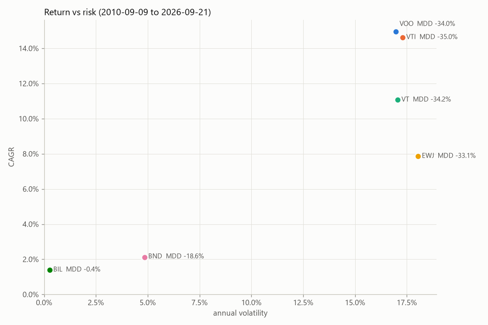
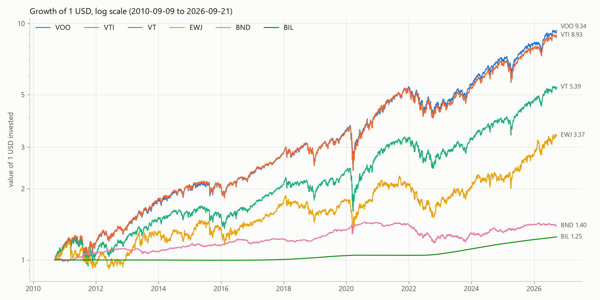
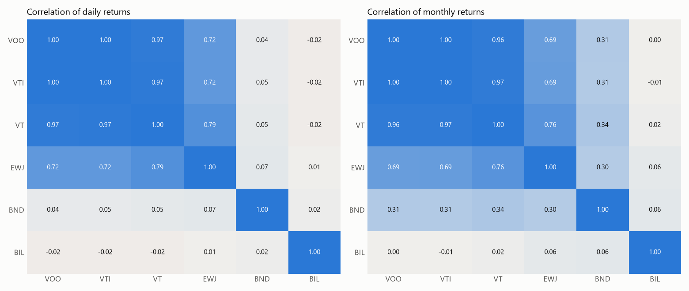
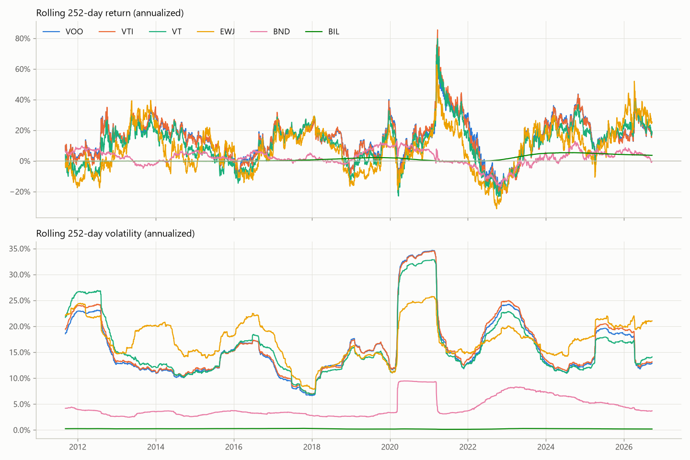

### 各資産の特徴(データから言えること)

**VOO と VTI:ほぼ同じ資産**
- 相関は日次・月次とも 1.00。CAGR の差は 0.3 ポイント、ボラティリティの差も 0.3 ポイントしかない。
- この期間では、米国の中小型株まで広げても値動きはほとんど変わらなかった。両方を持っても分散の効果はない。

**VT:ボラティリティは米国株と同じだが、リターンは低い**
- ボラティリティ(17.1%)と最大DD(−34.2%)は米国株とほぼ同じ。一方、CAGR は VOO より 3.9 ポイント低い。
- 米国株との相関は 0.96〜0.97 と高い。この期間については、米国以外の株を加えても下落の大きさはほとんど減らず、リターンだけが下がった。

**EWJ:株式の中で最も弱く、最も分散に効く**
- 株式4資産の中で CAGR が最も低く(7.9%)、ボラティリティは最も高い(18.0%)。
- 直前の高値から10%以上下がっていた日の割合は 37%。VOO(12%)の約3倍で、下落が長引きやすい。最大DD は 2022-10-20 で、回復したのは 2024-03-06。
- 米国株との相関は 0.69 で、株式の中では最も低い。一方で 2020年のコロナショックでは、1年ボラティリティの最大値が 25.8% と米国株(34.7%)より低かった。
- USD 建てなので、円とドルの為替の動きがリターンに含まれている。日本株そのものの成績と為替の影響は、まだ分けていない。

**BND:値動きは小さいが、2022年に大きく下げた**
- ボラティリティは 4.9% で、株式の約3分の1。ただし 2022年の利上げ局面で −18.6% 下落し、2026-09-21 時点でもまだ以前の高値に戻っていない。
- 株との相関は、期間によって大きく変わっている。

  | 期間 | VOO との相関(月次) | VOO との相関(日次) |
  |---|---|---|
  | 2010〜2021年 | 0.00 | −0.08 |
  | 2022〜2026年 | 0.64 | 0.23 |

  全期間の数字(月次 0.31、日次 0.04)だけを見ると、この変化が見えない。2022年以降は株と債券が同じ方向に動きやすくなり、実際に 2022年は両方が大きく下げた(VOO −18.2%、BND −13.1%)。

**BIL:ほぼ値動きのない現金の代わり**
- ボラティリティは 0.26%、最大DD は −0.4%。他の資産との相関はほぼ 0。
- リターンは短期金利そのもの。年次リターンは、2010〜2017年と2020〜2022年は 0〜1% 台、2018〜2019年は約 2%、2023〜2024年は約 5% だった。

### 解釈するときの注意

- 結果は **2010〜2026年という1つの期間** のもの。この期間は米国株が特に強かった。期間を変えれば順位も変わりうる(PLAN.md の原則「バックテストを過信しない」)。
- すべて **USD 建て** の結果。円で投資する場合は、これに円とドルの為替の変動が加わる。
- 相関は計算する頻度(日次・月次)と期間によって大きく変わる。1つの数字だけで判断しない。

### 次に検討すること

- Phase 5: バックテスト基盤
- 投資戦略を共通インターフェースで記述
- 売買・ポジション・キャッシュ・コストを含む再現可能なバックテスト
- ローリング相関(相関が時間とともにどう変わるかを常に追う)
- 円建てでの比較(為替レートの取り込み、または東証上場 ETF の追加)
- Phase 3:積立投資シミュレーション
