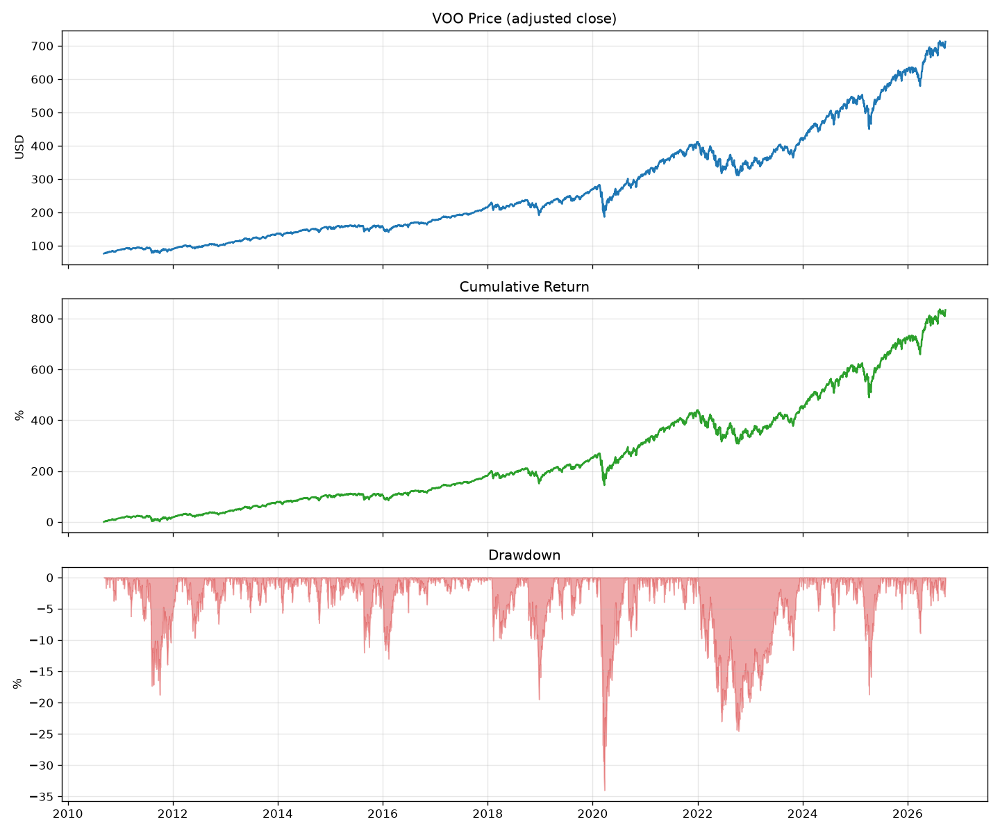
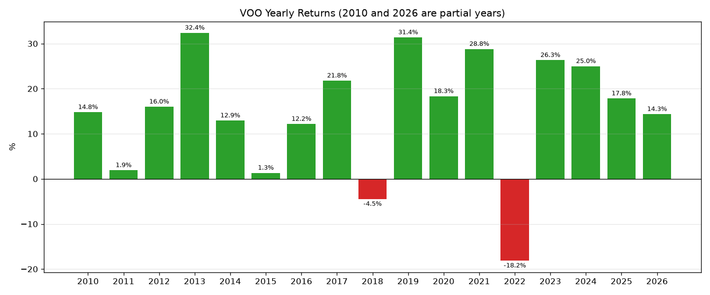

# investment-research

投資リサーチ用の市場データ取得・分析プロジェクト。

## セットアップ

```
python -m venv .venv
.venv\Scripts\activate
pip install -r requirements.txt
```

## 実行方法

```
python src/data/fetch_voo.py        # データ取得 → data/raw/voo.csv
python src/data/quality_check.py    # データ品質チェック
python src/analysis/analyze_voo.py  # 指標計算・レポート出力 → reports/
```

## ディレクトリ構成

```
src/
├─ data/
│  ├─ fetch_voo.py       VOO の日次データを取得して CSV に保存
│  └─ quality_check.py   CSV の欠損・重複・異常値をチェック
└─ analysis/
   └─ analyze_voo.py     リターン・リスク指標の計算とグラフ・CSV 出力
data/
└─ raw/voo.csv           取得した生データ
reports/
├─ figures/
│  ├─ voo_analysis.png         価格・累積リターン・ドローダウン
│  └─ voo_yearly_returns.png   年次リターンの棒グラフ
├─ voo_yearly_returns.csv
└─ voo_monthly_returns.csv
```

## データ仕様

### 取得データ `data/raw/voo.csv`

| 項目 | 内容 |
|---|---|
| 取得元 | Yahoo Finance(yfinance 1.7) |
| 銘柄 | VOO(Vanguard S&P 500 ETF) |
| 期間 | 上場日 2010-09-09 〜 取得時点で確定している最新営業日 |
| 頻度 | 日次(通常取引時間のみ、時間外取引は含まない) |
| 価格 | 株式分割・配当を反映した調整後価格(`auto_adjust=True`)。Close は配当再投資込みのトータルリターンベース |
| 列 | Close, High, Low, Open(USD)、Volume(株数) |
| 形式 | ヘッダーが3行(`Price` / `Ticker` / `Date`)、以降1営業日1行 |

取得時に除外する行:

- Open / High / Low / Close のいずれかが欠損している行(Yahoo が出来高だけ返すことがあるため)
- ニューヨーク時間 16:00 の終値確定前に取得した場合の当日の行(取引途中の値のため)

注意点:

- 調整後価格は Yahoo 側で取得のたびに再計算されるため、再取得すると過去の値も小数点以下でわずかに変わる。git の差分が CSV 全体に出るのはこのため。
- 米国市場の祝日は行がない(2010〜2026年で平日151日分)。

### レポート `reports/`

| ファイル | 内容 |
|---|---|
| `voo_yearly_returns.csv` | 列 `year, return`。暦年ごとのリターン |
| `voo_monthly_returns.csv` | 列 `month, return`(`month` は `YYYY-MM`)。月ごとのリターン |

- リターンは小数(0.25 = 25%)。各期末の調整後終値を前期末と比べて計算。
- 最初の期(2010年 / 2010-09)は初日の終値から、最後の期は最新日までの途中の値。

### 指標の定義(`analyze_voo.py`)

| 指標 | 計算方法 |
|---|---|
| 累積リターン | 最終日終値 ÷ 初日終値 − 1 |
| 年率リターン(CAGR) | (1 + 累積リターン) ^ (1 / 年数) − 1。年数 = 日数 ÷ 365.25 |
| 年率ボラティリティ | 日次リターンの標準偏差 × √252 |
| 最大ドローダウン | 各日の終値 ÷ その日までの最高値 − 1 の最小値 |

## Phase 1 で達成したこと

市場データを取得し、品質を確認し、基本的なパフォーマンス指標を出すまでのパイプラインを作った。

1. **環境構築**:`.venv` の仮想環境に pandas / numpy / yfinance / matplotlib を導入
2. **データ取得**:VOO の全期間の日次データを取得し CSV に保存。取得条件をコード上で明示し、欠損行や取引途中の行を除外
3. **品質チェック**:欠損値・重複日付・0 以下の価格・High < Low・営業日の抜けを検査し、すべて問題なし
4. **分析**:累積リターン・CAGR・年率ボラティリティ・最大ドローダウンを計算
5. **レポート**:価格・累積リターン・ドローダウンのグラフ、年次リターンのグラフ、年次・月次リターンの CSV を出力
6. **公開**:GitHub で管理

### 結果(2010-09-09 〜 2026-09-21)

| 指標 | 値 |
|---|---|
| 累積リターン | +834.02% |
| 年率リターン(CAGR) | 14.95% |
| 年率ボラティリティ | 16.97% |
| 最大ドローダウン | −33.99%(2020-03-23、コロナショック) |

年次リターンでマイナスだったのは 2018年(−4.5%)と 2022年(−18.2%)のみ。最も高かったのは 2013年(+32.4%)。



